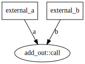
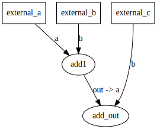
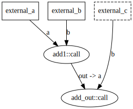
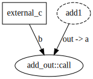

# What is circuit

Circuit is a dataflow tool meant for high performance event processing, with HFT signal calculation in mind.

## What is a circuit

A circuit can be thought of a computation graph. A circuit consists of:

1. A set of inputs that come from outside the circuit, called external inputs
2. A set of computation nodes, each taking some set of inputs and generating some outputs.
3. A set of possible events, also called triggers. These define a set of inputs that are modified

Let's take a basic example from the codegen tests, add two numbers together. This takes two inputs, a and b, and adds them together. There's also a single event that triggers both inputs

We can consider another example, where we add three numbers (a, b, an c). We also do so with two distinct events, one that updates a and b, and one that updates c.

The entire circuit is

and we would have two call paths generated:

## Why Circuit?

The main selling point of circuit is to allow higher level construction of tactics without sacrificiing performance (and potentially gaining it)! How does Circuit allow this?

1. Circuit composes many small units of functionality as a dataflow graph, allowing users to declaratively specify the desired computation without having to manually manage control flow for given events
2. Circuit modules have no global state and are only concerned with their own inputs and outputs, making it safe and easy to compose anything
3. Circuit allows a full type system of inputs and outputs, so it's easy to factor out any repeated computation
4. Circuit generates C++ specialized C++ code for each given event, giving performance that rivals and can beat hand-written code
5. Circuit allows programatic construction of tactics, moving towards a code-is-data model. This allows for example generating many different signal graphs for different signals, using whatever from the library gives the best predictive power instead of a one-size-fits-all model